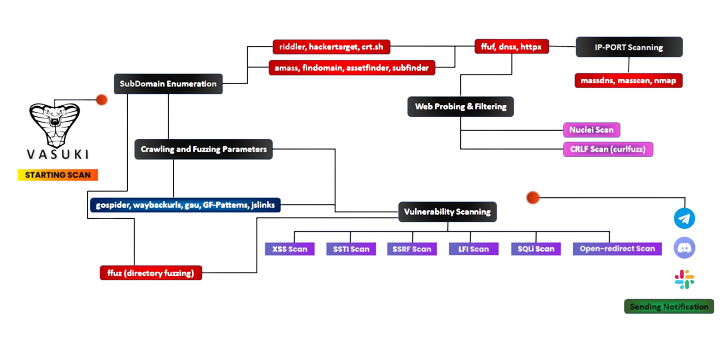

<h1 align="center">
  <br>
  <a href="https://github.com/cyb3rzest/Vasuki/"></a>
</h1>
                                                                                                                                            
<h4 align="center">An automation tool that scans sub-domains, sub-domain takeover and then filters out xss, ssti, ssrf and more injection point parameters.</h4>

<p align="center">
<a href="#"></a>
<a href="https://buymeacoffee.com/cyb3rzest"></a>
<a href="https://twitter.com/cyb3rzest/"></a>
<a href="https://github.com/cyb3rzest/Vasuki/issues"></a>
<a href="https://github.com/cyb3rzest/Vasuki/blob/master/LICENSE"></a>
<a href="#"></a>
<a href="https://github.com/cyb3rzest?tab=followers"></a>
<a href="https://github.com/LuD1161"></a>
</p>

---

I made this tool to automate my recon and save my time. It really give me headache always type such command and then wait to complete one command and I type other command. So I collected some of the tools which is widely used in the bugbounty field. In this script I used findomain, assetfinder, subfinder, amass, httpx, massdns, masscan, nmap, sublister, gauplus and gf patterns and then it uses dirsearch, dalfox, nuclei and kxss to find some low-hanging fruits.<br/> 

The script first enumerates all the subdomains of the give target domain using assetfinder, sublister, subfinder, findomain and amass then filters all live domains from the whole subdomain list then it extarct titles of the subdomains using httpx, then it scans for IP-Ports as well as perfom nmap scan, then it scans for subdomain takeover using nuclei. Then it uses gauplus to extract paramters of the given subdomains then it use gf patterns to filters xss, ssti, ssrf, sqli params from that given subdomains and then it scans for low hanging fruits as well. Then it'll save all the output in a text file like target-xss.txt. Then it will send the notifications about the scan using notify. <br/>


<h3 align="left">How vasuki works</h3>
<p align="center"><br/>
<br/>
<!--  -->
</p><br/>

<h3>Installation</h3>

**Requirements:** ``Go Language`` and ``Python 3``.<br>
**System requirements:** Recommended to run on vps with ``1VCPU`` and ``2GB RAM``.<br>

**Tools used - You must need to install these tools to use this script**<br>

  <a href="https://github.com/projectdiscovery/subfinder">`subfinder`</a> •
  <a href="https://github.com/aboul3la/Sublist3r">`sublist3r`</a> •
  <a href="https://github.com/1ndianl33t/Gf-Patterns">`gf patterns`</a> •
  <a href="https://github.com/projectdiscovery/dnsx">`dnsx`</a> •
  <a href="https://github.com/tomnomnom/assetfinder">`assetfinder`</a> •
  <a href="https://github.com/projectdiscovery/httpx">`httpx`</a> •
  <a href="https://github.com/Emoe/kxss">`kxss`</a> •
  <a href="https://github.com/projectdiscovery/nuclei">`nuclei`</a> •
  <a href="https://github.com/hahwul/dalfox">`dalfox`</a> •
  <a href="https://github.com/tomnomnom/anew">`anew`</a> •
  <a href="https://github.com/projectdiscovery/notify">`notify`</a> •
  <a href="https://github.com/michenriksen/aquatone">`aquatone`</a> •
  <a href="https://github.com/OWASP/Amass">`amass`</a> •
  <a href="https://github.com/lc/gau">`gau`</a> •
  <a href="https://github.com/dwisiswant0/crlfuzz">`crlfuzz`</a> •
  <a href="https://github.com/s0md3v/uro">`uro`</a> •
  <a href="https://github.com/ffuf/ffuf">`ffuf`</a> •
  <a href="https://github.com/projectdiscovery/naabu">`naabu`</a> •
  <a href="https://github.com/blechschmidt/massdns">`massdns`</a> •
  <a href="https://github.com/robertdavidgraham/masscan">`masscan`</a> •
  <a href="https://github.com/OJ/gobuster">`gobuster`</a> •
  <a href="https://github.com/jaeles-project/gospider">`gospider`</a> •
  <a href="https://github.com/tomnomnom/waybackurls">`waybackurls`</a><br>


```bash
#Make sure you're root before installing the tool

vasuki:~ sudo su
vasuki:~ apt install git
vasuki:~ git clone https://github.com/cyb3rzest/Vasuki.git && cd Vasuki/ && chmod +x vasuki vasuki_install.sh && mv vasuki /usr/bin/ && ./vasuki_install.sh
```

> **Note**: If you encounter any-issue while running `vasuki_install.sh` file or `vasuki` run `sed -i -e 's/\r$//' vasuki_install.sh`

<h3>Usage</h3>


```js 


                ██╗░░░██╗░█████╗░░██████╗██╗░░░██╗██╗░░██╗██╗
                ██║░░░██║██╔══██╗██╔════╝██║░░░██║██║░██╔╝██║
                ╚██╗░██╔╝███████║╚█████╗░██║░░░██║█████═╝░██║
                ░╚████╔╝░██╔══██║░╚═══██╗██║░░░██║██╔═██╗░██║
                ░░╚██╔╝░░██║░░██║██████╔╝╚██████╔╝██║░╚██╗██║
                ░░░╚═╝░░░╚═╝░░╚═╝╚═════╝░░╚═════╝░╚═╝░░╚═╝╚═╝

[VASUKI] == A Reconnaissance Suite for BUG-HUNTERS (@CyberZest)
Subscribe on YouTube (@CyberZest)

Example Usage:
vasuki [-d target.tld] [-x exclude domains] [-r resolvers] [-rF resolvers list] [--json] [-s]

Flags:
   -d, --domain            string       Add your target                         -d target.tld
   -x, --exclude           string       Exclude out of scope domains            -x ~/dommains.list
   -r, --resolver          string       Resolver Name                           -r 8.8.8.8, 8.8.4.4, 10.10.10.10
   -rF, --resolvers        string       Resolver File List                      -rF ~/resolver.txt

Optional Flags:
   -s, --silent        Hide output in the terminal             Default: False
   -j, --json          Store output in a single json file      Default: False
   -v, --version       Print current version of vasuki

```
**Fix errors while using or installing vasuki**
    
```bash
vasuki:~ chmod +x vasuki_install.sh && ./vasuki_install.sh
Error: ./vasuki_install.sh : /bin/bash^M : bad interpretor: No such file or directory
                                                    
# fix
vasuki:~ sed -i -e 's/\r$//' vasuki_install.sh
```
You can also copy the error and search on google this will make your debugging skills better ;)

**Example Usage**

```txt
# vasuki -d hackerone.com
```
Exclude out of scope domains
```txt
# echo test.hackerone.com > excludedomain.txt
# vasuki -d hackerone.com -x ~/excludedomain.txt
```
With all flags
```txt
# vasuki -d hackerone.com -j -s -x /home/excludedomain.txt
```

Hide output in the terminal

```txt
# vasuki -d hackerone.com -s
```

Store output in a single `json` file

```txt
# vasuki -d hackerone.com -s -j
# cd ~/vasuki_results/hackerone-$date
# cat output.json | jq
{
  "nuclei_critical": [],
  "vuln_crlf": [],
  "dalfox": [
    "[POC][V][GET][inATTR-double(3)-URL] http://subdomain.target.tld/hpp?pp=FUZZ%22onpointerout%3Dconfirm.call%28null%2C1%29+class%3Ddalfox+",
    ----------------------snip----------------------
    "subdomains": [
      "sub.target.tld",
      "tub.target.tld",
      "subdomain.target.tld"
  ],
  "vuln_xss": [
    "[POTENTIAL XSS] - http://subdomain.target.tld/hpp/?pp=%22%3E%2F%3E%3Csvg%2Fonload%3Dconfirm%28document.domain%29%3E ",
    "[POTENTIAL XSS] - http://subdomain.target.tld:80/hpp/?pp=%22%3E%2F%3E%3Csvg%2Fonload%3Dconfirm%28document.domain%29%3E ",
    "[POTENTIAL XSS] - http://subdomain.target.tld:80/hpp/index.php?pp=%22%3E%2F%3E%3Csvg%2Fonload%3Dconfirm%28document.domain%29%3E "
  ]
}
```

**Docker**


This image needs to be built with [`Buildkit`](https://docs.docker.com/develop/develop-images/build_enhancements/)
```bash
vasuki:~ git clone https://github.com/cyb3rzest/vasuki.git
vasuki:~ cd vasuki 
vasuki:~ docker buildx build -t vasuki -f Dockerfile .
```

To run the container
```bash
vasuki:~ docker run -t --rm \
  -v "/path/on/host":"/output" \   # Mount the Host Output Folder to "/output"
  -v "/path/to/configs":"/vasuki/.config/notify" \   # Mount your Notify Config files to "/vasuki/.config/notify"
  vasuki -d hackerone.com
```
vasuki runs as root inside the container & so it is advisable to configure Linux Namespaces 
1. [Isolate containers with a user namespace](https://docs.docker.com/engine/security/userns-remap/)
2. [Use Linux user namespaces to fix permissions in docker volumes](https://www.jujens.eu/posts/en/2017/Jul/02/docker-userns-remap/)

<h3>Notifications</h3>

[`@slack`](https://slack.com/intl/en-it/help/articles/115005265063-Incoming-webhooks-for-Slack) •
[`@discord`](https://support.discord.com/hc/en-us/articles/228383668-Intro-to-Webhooks) •
[`@telegram`](https://core.telegram.org/bots#3-how-do-i-create-a-bot) •
[`configure-notify`](https://github.com/projectdiscovery/notify#config-file)
                                                                
<p align="left">
<h3>Donate</h3> 

|[`buymeacoffee.com/cyb3rzest`](https://www.buymeacoffee.com/cyb3rzest)|[`PayPal India`](https://www.paypal.com/paypalme/ichiro94)|
|--------|--------|------|

### Thanks to the authors of the tools used in this script.

[`@aboul3la`](https://github.com/aboul3la) [`@tomnomnom`](https://github.com/tomnomnom) [`@lc`](https://github.com/lc) [`@hahwul`](https://github.com/hahwul) [`@projectdiscovery`](https://github.com/projectdiscovery) [`@maurosoria`](https://github.com/maurosoria) [`@shelld3v`](https://github.com/shelld3v) [`@devanshbatham`](https://github.com/devanshbatham) [`@michenriksen`](https://github.com/michenriksen) [`@defparam`](https://github.com/defparam/) [`@projectdiscovery`](https://github.com/projectdiscovery) [`@bp0lr`](https://github.com/bp0lr/) [`@ameenmaali`](https://github.com/ameenmaali) [`@dwisiswant0`](https://github.com/dwisiswant0) [`@OWASP`](https://github.com/OWASP/) [`@1ndianl33t`](https://github.com/1ndianl33t) [`@sqlmapproject`](https://github.com/sqlmapproject) [`@w9w`](https://github.com/w9w) [`@OJ`](https://github.com/OJ) [`@jaeles-project`](https://github.com/jaeles-project) [`@s0md3v`](https://github.com/s0md3v) [`@ffuf`](https://github.com/ffuf) [`@blechschmidt`](https://github.com/blechschmidt/) [`@robertdavidgraham`](https://github.com/robertdavidgraham/) [`@Asheem Shrey`](https://github.com/LuD1161/)


**Warning:** This code was originally created for personal use, it generates a substantial amount of traffic, please use with caution.
